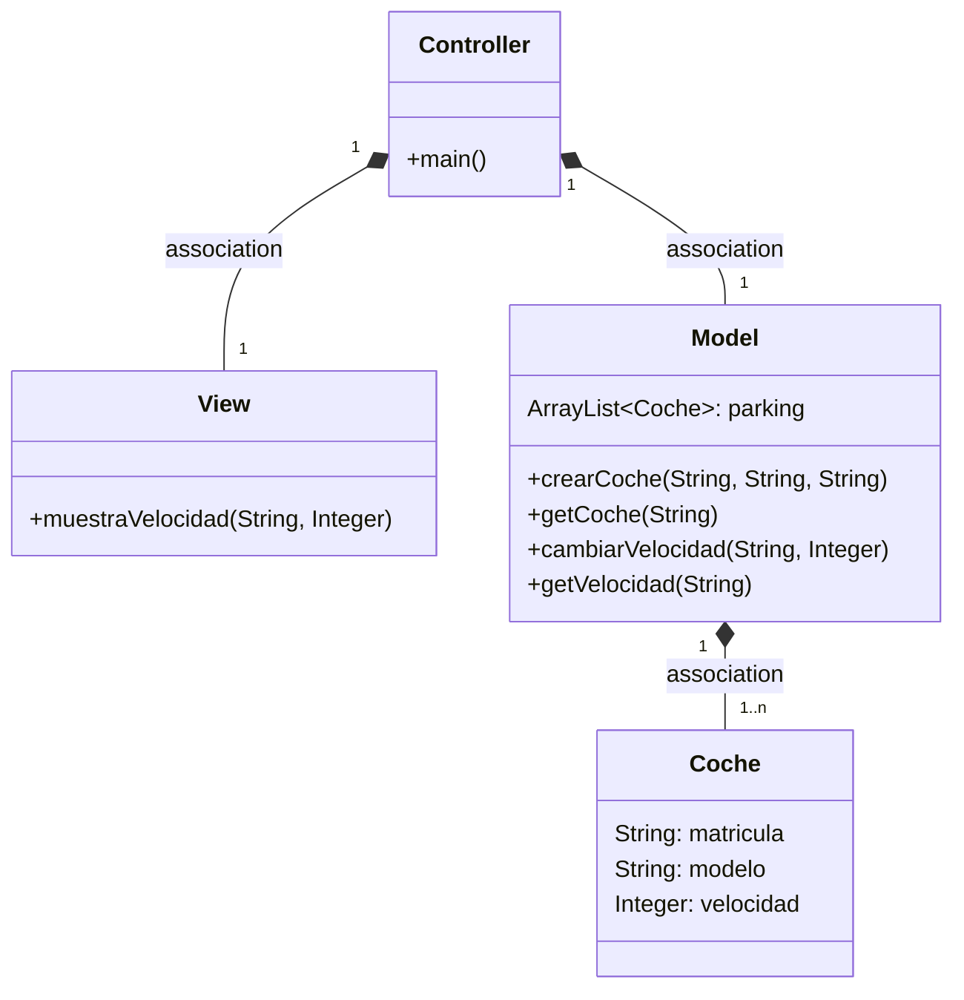
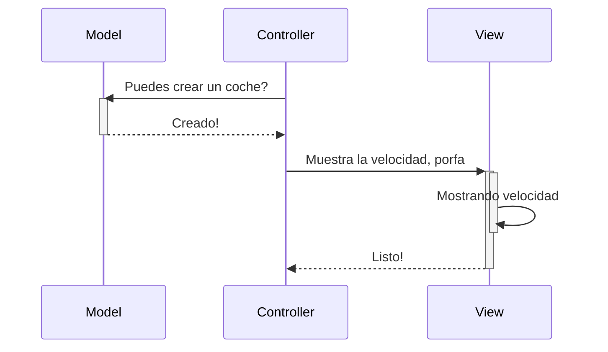
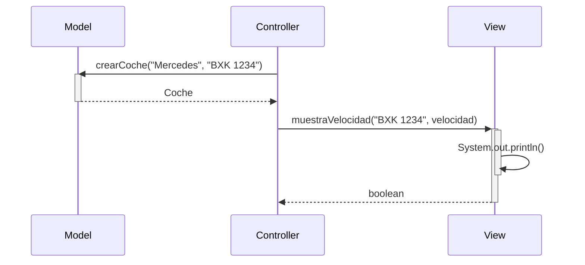

# Readme Examen1

1. Comencé con un commit que señala cuando he empezado la codificación.
2. Modifiqué la View para añadir las opciones que permiten Avanzar y Añadir Gasolina.
3. Los pasos a partir de aquí los hice por separado primero de avanzar y a continuacion de añadirGasolina.
4. En el controller pasé la informacion necesaria de la View al Model.
5. En el Model realicé las funciones. Avanzar permite añadir metros y añadirGasolina permite añadir litros.
6. A lo largo de la codificacion me intenté adaptar al pseudocodigo pero me fui dando cuenta que había pequeñas instrucciones innecesarias.
----
Antes del 2º examen corregí mi codigo anterior.
----
# Readme Examen2
1. Comencé con un commit que señala cuando he empezado la codificación.
2. Añadí la clase Observer y generé el método update para alarmar al usuario cuando el coche tiene menos de 10 litros de gasolina.
3. Dentro del Model en el metodo ponerGasolina añadí la llamada al método update del Observer.
4. En la View añadí el metodo alarmaRepostar.
5. Luego generé el diagrama de secuencia en el archivo `Diagrama.md` junto al resto de diagramas que ya tenía.
6. Repasé el codigo y modifique algunos detalles en caunto a la gasolina.

# Arquitectura MVC

Aplicación que trabaja con objetos coches, modifica la velocidad y la muestra

---
## Diagrama de clases:

---

## Diagrama de Secuencia

Ejemplo básico del procedimiento, sin utilizar los nombres de los métodos

El mismo diagrama con los nombres de los métodos

